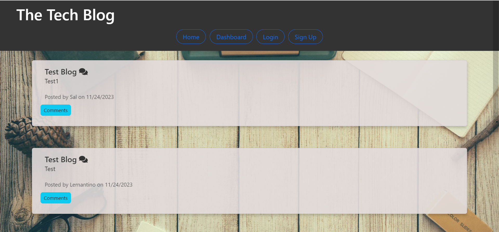
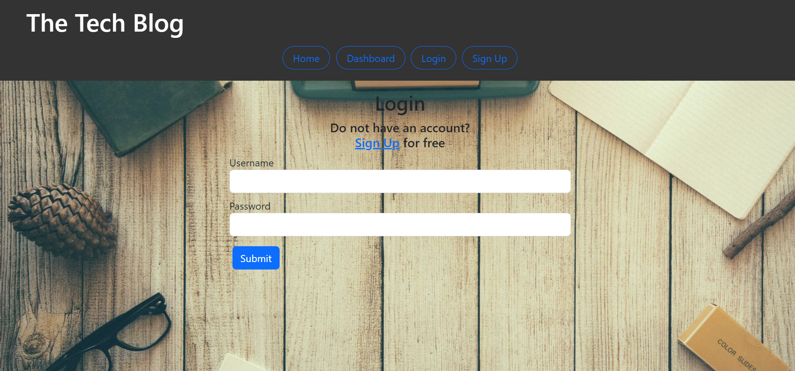
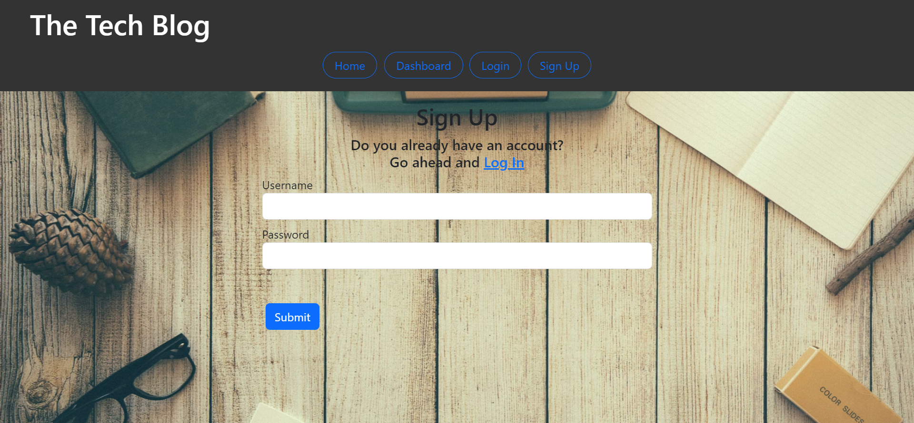
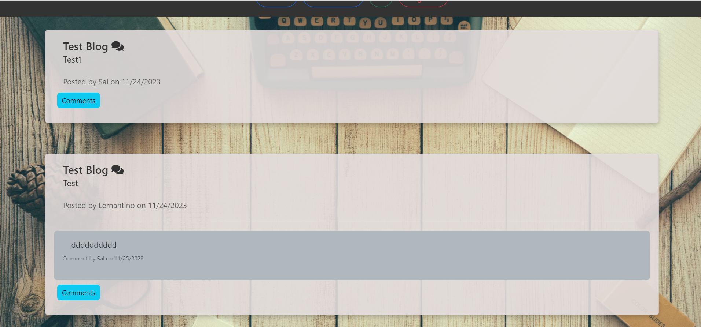
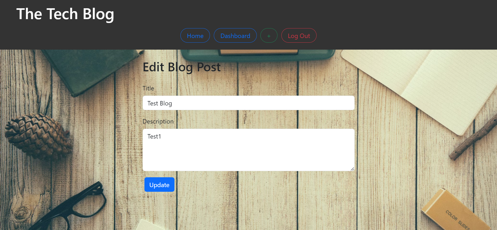
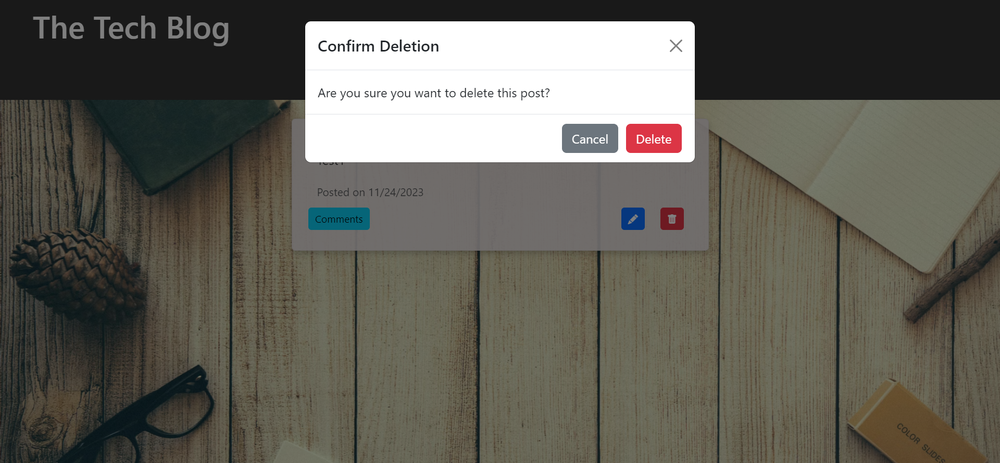

# Tech-Blog-MVC
Tech Blog is a web application that allows users to create, edit, and view blog posts related to technology.
 Users can also leave comments on blog posts.

## Description
.User registration and authentication system.
.Create and edit blog posts.
.View blog posts with comments.
.Leave comments on blog posts.
.Delete your own blog posts.

#Technologies Used
.Frontend:
HTML, CSS
JavaScript
Bootstrap for styling
Handlebars.js for templating
.Backend:
Node.js
Express.js
Sequelize as the ORM for the database
MySQL for the database
.Authentication:
Sessions for user authentication
Deployment:
Deployed on [Heroku] [Github]

## Table of Contents
.Installation
.Usage
.API Endpoints
.ScreenShots

## Installation

1. Clone the repository to your local machine.

2. Navigate to the project directory in your terminal.

3. Run npm install to install necessary dependencies, which include:
mysql2: For database connections.
This will install necessary packages like express, sequelize, mysql2, dotenv, and nodemon (as a dev dependency).

4. Set up your MySQL database:
Ensure you have MySQL installed and running on your machine.
Use the provided schema.sql file to set up your database.
(Optional) Use the seeds.sql file to populate your tables with sample data.

5. Update the database connection configuration (user, password, database, etc.) in the main application file to match your local MySQL setup.
# To install the necessary dependencies, run:
bash
Copy code
\`\`\`
npm install
\`\`\`
This command will install the required packages.

# Running the Application:
To start the application, in your terminal type:

bash
Copy code
\`\`\`
mysql -u root -p (you will then be asked to provide your password)
\`\`\`

\`\`\`
source db/schema.sql;
\`\`\`

\`\`\`
exit
\`\`\`

\`\`\`
npm run seeds
\`\`\`

\`\`\`
node server.js
\`\`\`

## Usage
.once users run the webpage they will be having a home page showing all blog posts of all users.
.navigaton bar will also be having home btn, dashboard btn, login btn and signup btn.
.users will have the ability to sign up filling the sign up form then redirect back to the home page.
.if user is already has an account then using the login btn will get them to login to their dashboard.
.logged in users will be able to create posts, delete their posts, updating their posts and adding comments to anyy post.

## Screenshots

## Deployed Github link

## Deployed Heroku link